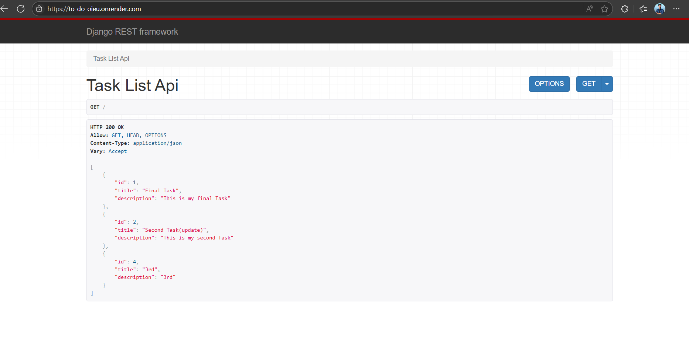
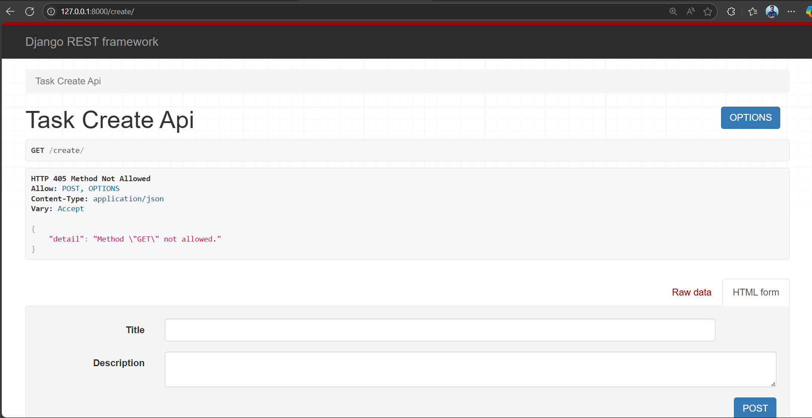
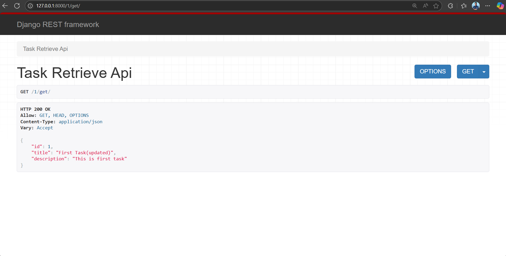
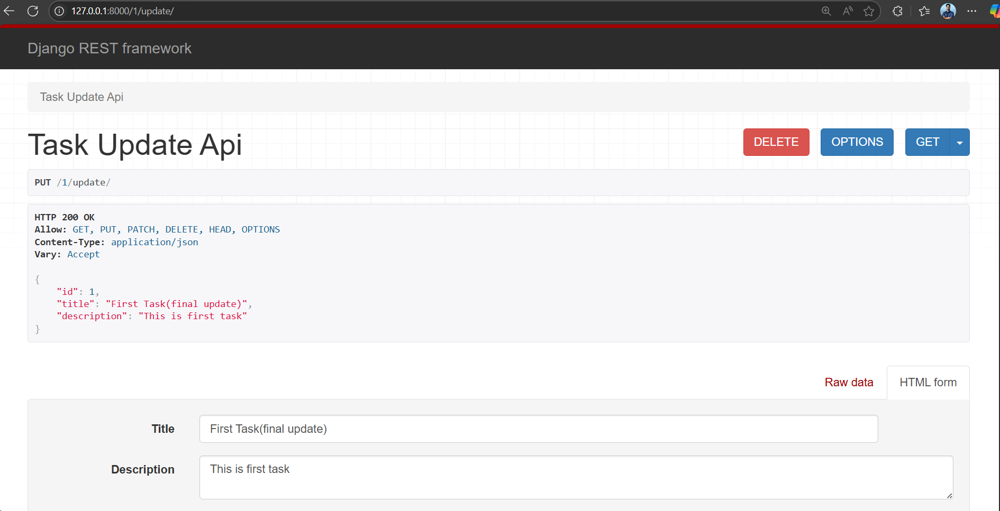
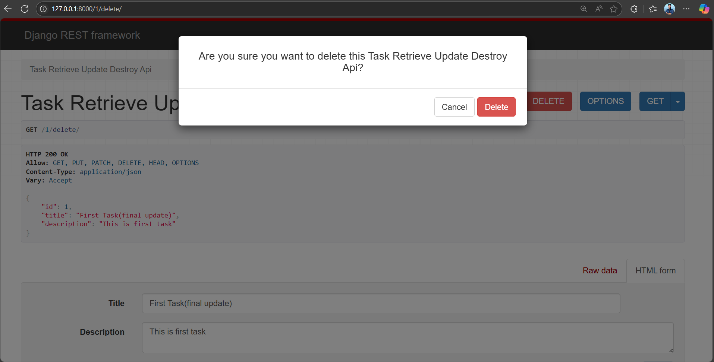

# ToDo Task API

This is a simple ToDo Task REST API project built with Django and Django REST Framework.  
It provides basic CRUD operations (Create, Read, Update, Delete) for managing tasks.

---

## Features

- Add new tasks with title and optional description
- List all tasks
- Update existing tasks
- Delete tasks

---

## Technologies Used

- Python 3.12
- Django 5.2.1
- Django REST Framework 3.16.0
- SQLite (default Django database)
- PostgreSQL for Render live deployment
- django-filter

---

## Project Setup and Installation

Follow these steps to set up and run the project locally:

### 1. Clone the repository

git clone repository-url

cd ToDo_Task

### 2. Create and activate a virtual environment

It’s recommended to use a virtual environment to isolate dependencies:

- On **Windows**:

python -m venv room1

.\room1\Scripts\activate.bat

### 3. Install necessary packages

Install Django REST Framework and supporting packages for the REST API:

pip install djangorestframework

pip install markdown        # For browsable API documentation support

pip install django-filter   # For filtering API queries

Also, add 'rest_framework' to your INSTALLED_APPS in settings.py:

INSTALLED_APPS = 

[
    
    # other apps...

    'rest_framework',
]

### 4. Freeze dependencies

After installing packages, generate your requirements.txt to track dependencies:

pip freeze > requirements.txt

### 5. Apply database migrations

Set up the database schema:

python manage.py makemigrations

python manage.py migrate

### 6. (Optional) Create a superuser for admin access

python manage.py createsuperuser

Follow the prompts to create admin credentials.

### 7. Run the development server

python manage.py runserver

---

## Serializers Explanation

In the todo app, a serializers.py file is created.

Why serializers are used:

- Convert complex data to JSON (or other formats): Serializers translate Django model instances into JSON so clients like browsers or apps can understand.
- Validate input data: When clients send data to create or update objects, serializers validate data correctness (required fields, data types, etc.).
- Convert incoming JSON back to complex objects: After validation, serializers convert JSON into Django models or Python objects for backend processing.
- Control exposed fields: You can customize serializers to expose only certain model fields or mark fields as read-only.

---

## Project Structure Overview

- ToDo_Task/ — main Django project folder
  - settings.py — project settings including INSTALLED_APPS and middleware
  - urls.py — project-level URL routing
- todo/ — Django app containing task logic
  - models.py — defines the Task model with title and description fields
  - serializers.py — defines serializer for Task model
  - views.py — contains ViewSet for Task API endpoints (CRUD)
  - urls.py — app-level URL routing using DRF router
  - admin.py — registers Task model for Django admin

---

## Admin Panel

You can manage tasks through the Django admin panel at:

http://127.0.0.1:8000/admin/

Use the superuser credentials to log in.

---

## Project View 

Here is the All Task View: https://to-do-oieu.onrender.com/

Here is the Create View: https://to-do-oieu.onrender.com/create/

Here is the Get Specefic Task View: https://to-do-oieu.onrender.com/<<int:id>>/get/

Here is the Update View: https://to-do-oieu.onrender.com/<<int:id>>/update/

Here is the Delete View: https://to-do-oieu.onrender.com/<<int:id>>/delete/

## Get Project Live at: https://to-do-oieu.onrender.com/

